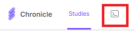

# Chronicle Bulk Data Downloader

Download every participant's data from a [Chronicle](https://getmethodic.com/) study in one go — as a desktop app, a CLI, or a Python package.

Not affiliated with Chronicle or GetMethodic.

> **Please do not lower or remove the rate limiting.** It exists to keep bulk downloads from overloading the Chronicle API for everyone else.

## Install

**Desktop app** — download a prebuilt build for Windows or macOS (Intel and Apple Silicon) from the [Releases](https://github.com/uzaira0/chronicle-bulk-data-downloader/releases) page. Nothing else to install.

**From source** (Python 3.11+):

```bash
git clone https://github.com/uzaira0/chronicle-bulk-data-downloader.git
cd chronicle-bulk-data-downloader
pip install ".[gui]"     # omit [gui] for CLI/library use only
```

## What you need

- A **study ID** — the 36-character identifier of the study in Chronicle.
- An **auth token**, copied from the Chronicle web app:

  

Tokens expire. If a download starts failing with authentication errors, copy a fresh one.

## Data types

| Data | CLI flag |
| --- | --- |
| Raw usage events (Android / Fire) | `--raw` |
| Preprocessed usage data | `--preprocessed` |
| App usage survey responses | `--survey` |
| iOS sensor data | `--ios-sensor` |
| Time use diary — daytime | `--time-use-diary-daytime` |
| Time use diary — nighttime | `--time-use-diary-nighttime` |
| Time use diary — summarized | `--time-use-diary-summarized` |

Pick at least one. Android data types (raw, preprocessed, survey) can be combined freely, but
iOS sensor data must be downloaded on its own run — the desktop app disables the Android
checkboxes while it is selected.

## Desktop app

```bash
chronicle-downloader-gui     # or: python main.py
```

Choose a download folder, paste your token and study ID, tick the data types you want, and press **Run**. Progress is shown live and the run can be cancelled at any point.

Optional extras:

- **Participant filter** — a comma-separated list of IDs. By default the listed IDs are *excluded*; tick "inclusive" to download *only* them.
- **Delete zero-byte files** — throws away empty CSVs (participants with no data for that type) once the run finishes.

Everything except the auth token is remembered after a successful run — folder, study ID,
filters and checkboxes come back the next time you open the app. The token is never written
to disk, so paste a fresh one each session.

## Command line

```bash
chronicle-downloader-cli \
  --study-id "<36-character-study-id>" \
  --auth-token "<token>" \
  --download-folder ./data \
  --raw --preprocessed --survey
```

| Option | Purpose |
| --- | --- |
| `--include-ids a,b,c` | Download only these participants |
| `--exclude-ids a,b,c` | Download everyone except these participants |
| `--delete-zero-byte-files` | Remove empty CSVs after the run |
| `--config-file cfg.json` | Read settings from a saved GUI config file (`--study-id`, `--auth-token` and `--download-folder` are still required on the command line and override the file) |
| `--verbose` / `-v` | Verbose logging |

`--include-ids` and `--exclude-ids` are mutually exclusive. Press `Ctrl+C` to cancel a run cleanly.

## Python package

```python
import asyncio

from chronicle_bulk_data_downloader import (
    AuthConfig,
    ChronicleDownloader,
    DataTypeConfig,
    DownloadConfig,
)

config = DownloadConfig(
    auth=AuthConfig(study_id="<36-character-study-id>", auth_token="<token>"),
    data_types=DataTypeConfig(download_raw=True, download_preprocessed=True, download_survey=True),
    download_folder="./data",
    delete_zero_byte_files=True,
)

asyncio.run(ChronicleDownloader(config=config).download_all())
```

`ChronicleDownloader` also takes optional `progress_callback` and `cancellation_check` callables, and exposes `get_participants()`, `filter_participants()`, `organize_data()` and `archive_data()` if you want to drive the steps yourself. `FilterConfig` handles include/exclude lists and `DateRangeConfig` (from `chronicle_bulk_data_downloader.core`) limits a download to a date window.

To get data back as a [Polars](https://pola.rs/) DataFrame instead of CSV files, install `polars` and use `fetch_data_type()`:

```python
from chronicle_bulk_data_downloader import ChronicleDownloadDataType

downloader = ChronicleDownloader(config=config)
device_ids = asyncio.run(downloader.get_enrolled_device_ids())
df = asyncio.run(downloader.fetch_data_type(device_ids, ChronicleDownloadDataType.RAW))
```

## What lands on disk

Files are named `<participant> Chronicle <Device> <DataType> MM-DD-YYYY.csv` and sorted into folders in your download directory:

```
data/
├── Chronicle Android Raw Data Downloads/
├── Chronicle Android Preprocessed Data Downloads/
├── Chronicle Android Survey Data Downloads/
├── Chronicle iOS Sensor Data Downloads/
└── Chronicle Time Use Diary Data Downloads/
```

Re-running on a later day moves the previous day's files into a dated `... Archive/` subfolder, so each folder holds today's download and a history beside it.

## Development

```bash
pip install -e ".[dev,gui]"
pytest tests/ -v
basedpyright chronicle_bulk_data_downloader/
ruff check chronicle_bulk_data_downloader/ tests/
```

Tests, type checking and linting run on Windows, macOS and Linux against Python 3.11 and 3.13 via GitHub Actions. Tagging `v*` builds and publishes the desktop executables.

## License

[GNU General Public License v3.0 or later](./LICENSE).
